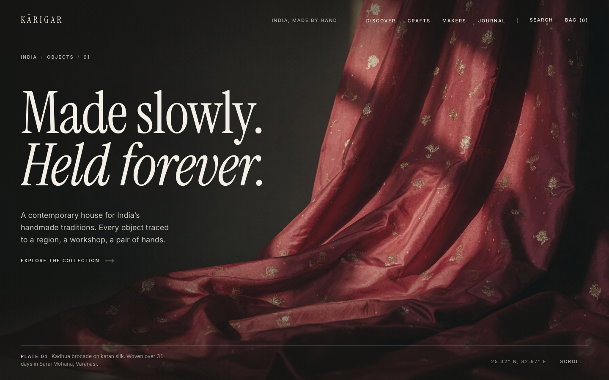
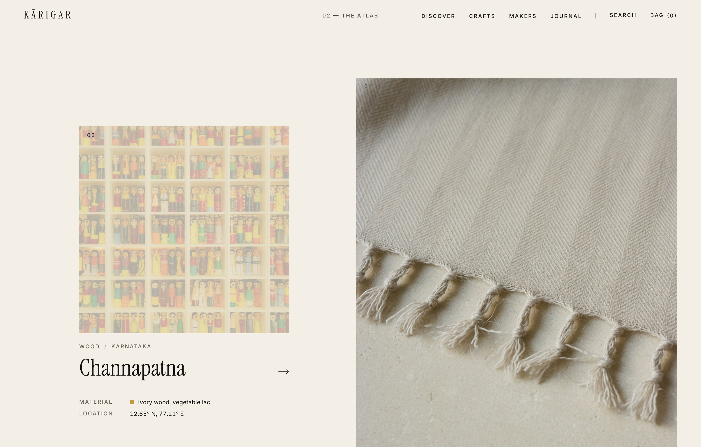
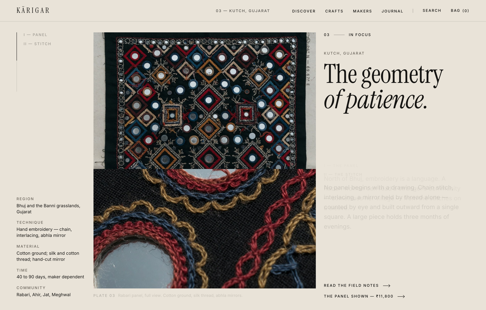
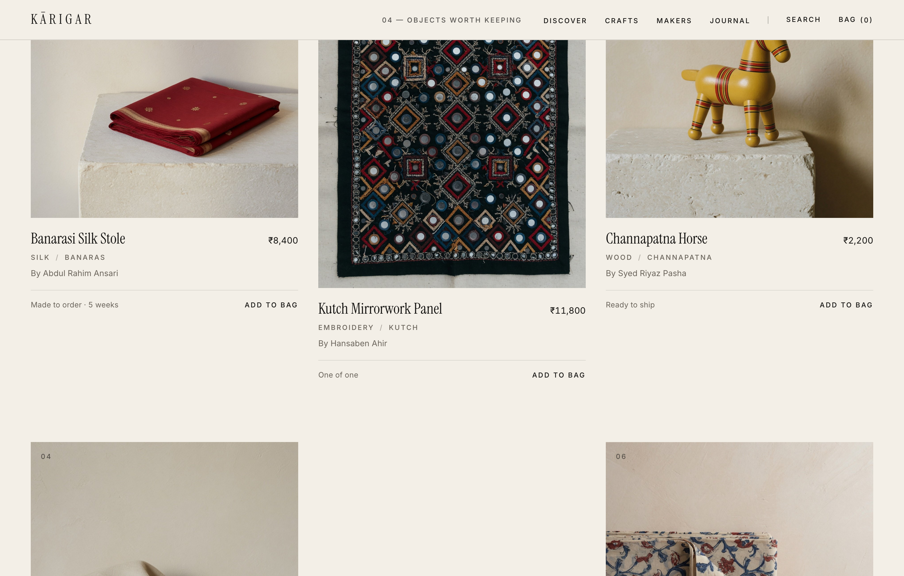
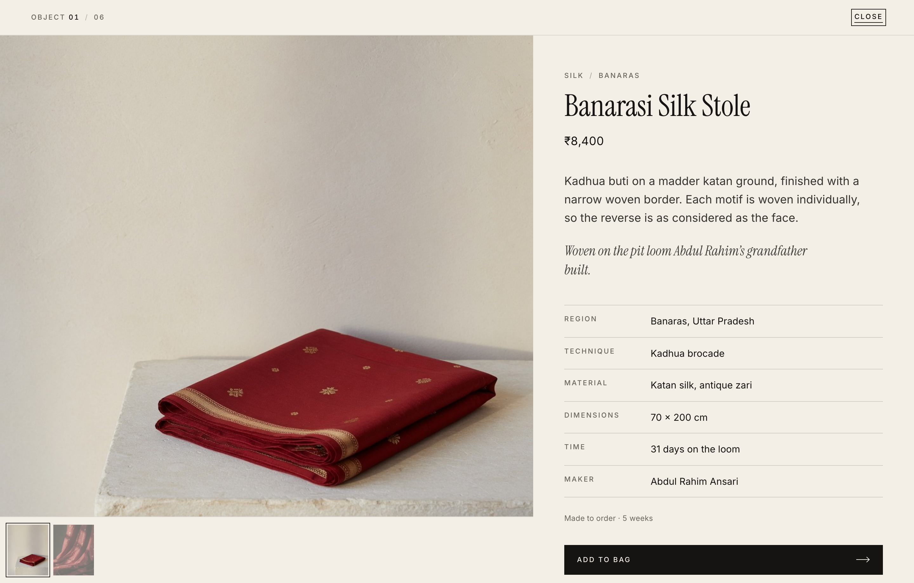
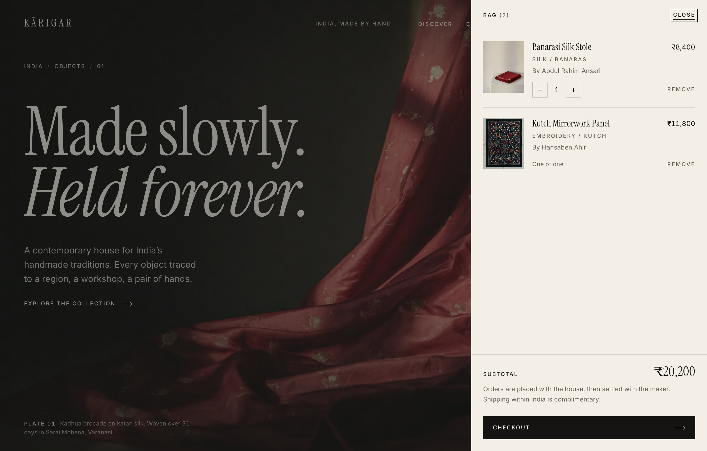
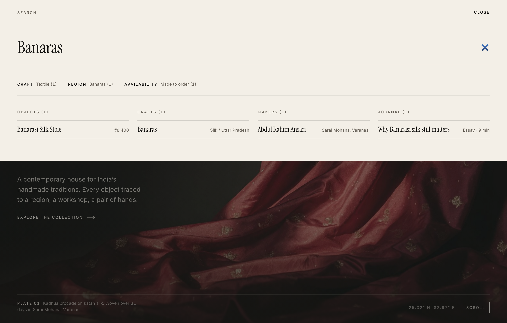

<div align="center">

# K Ā R I G A R
### कारीगर · INDIA, MADE BY HAND

*A contemporary digital house for India’s handmade traditions.*  
*Every object traced to a region, a workshop, and a pair of hands.*

[](https://react.dev/)
[](https://www.typescriptlang.org/)
[](https://vitejs.dev/)
[](https://tailwindcss.com/)
[](LICENSE)

<br/>

<p align="center">
  
</p>

</div>

---

## ✦ The Vision: Slow Luxury & Provenance

**Kārigar** is an editorial craft marketplace prototype designed to celebrate Indian artisanal heritage with the quiet dignity of slow luxury. Rejecting generic e-commerce patterns of urgency badges, discounts, and visual noise, Kārigar curates objects that require days, weeks, or months of singular focus at the loom, the lathe, or the needle.

> *"Made slowly. Held forever."*

Every piece in the collection is presented not merely as inventory, but as a living piece of geography and human lineage. We trace each object to its originating village, specific technique, raw material filaments, and master artisan.

---

## ✦ Visual Tour & Interface Demo

### 1. Editorial Cover & Hero
The landing sequence opens as a magazine cover. High-fidelity photography of hand-twisted Banarasi katan silk brocade catching low afternoon light, paired with custom display serif typography.
<div align="center">
  
</div>

---

### 2. The Craft Atlas (Interactive Regional Index)
Explore the geography of craft across the subcontinent. Each region highlights its latitude/longitude coordinates, principal medium, and indigenous heritage.
<div align="center">
  
</div>

---

### 3. In Focus: Craft Story & Field Notes
Deep editorial storytelling on traditional techniques. Features close-up stitch studies, historical background of Rabari and Ahir mirrorwork embroidery from the Banni grasslands of Kutch, and curated essays.
<div align="center">
  
</div>

---

### 4. Objects Worth Keeping (The Collection)
Minimalist product presentation placing craftsmanship front and center. Subtle hover transitions reveal macro details and alternate perspectives without disruptive layouts.
<div align="center">
  
</div>

---

### 5. Provenance & Object Sheet Modal
Clicking any work opens an immersive Object Sheet (`#object/[id]`). Deep-linkable via hash routes, it details dimensions, material compositions, craft technique, production time on the loom, and master artisan provenance.
<div align="center">
  
</div>

---

### 6. Curated Bag & Order Drawer
A slide-out drawer providing full transparency over items placed in the bag, subtotal calculation, quantity adjustments, and one-of-one status enforcement.
<div align="center">
  
</div>

---

### 7. Instant Omni-Search
A reading-first search experience activated globally via the `/` key or navigation header. Real-time categorised filtering across Objects, Craft disciplines, Artisan makers, and Journal essays.
<div align="center">
  
</div>

---

## ✦ Key Features & Interactions

- **Reading-First Typography & Palette**: Tailored warm bone and ink neutrals (`#F6F3ED`, `#161412`), subtle hairline dividers, and high-contrast editorial typography.
- **Hash-Routed Object Sheets**: Full product detail views mapped to `#object/[id]` for clean browser history navigation and direct URL sharing.
- **Persistent Bag State**: Cart state synchronised across browser sessions via `localStorage` with optimistic counter bumps.
- **Editorial Reveal Choreography**: Cascading entrance animations for headlines, plate frames, and typography that respect `prefers-reduced-motion`.
- **Keyboard Shortcuts**:
  - `/` — Open global omni-search dialog
  - `Escape` — Dismiss active modal sheets or search overlays
- **Single-File Bundle Ready**: Configured with `vite-plugin-singlefile` for self-contained distribution if required.

---

## ✦ Featured Crafts & Geographies

| Region | State | Primary Medium | Signature Technique | Master Artisan |
| :--- | :--- | :--- | :--- | :--- |
| **Banaras** | Uttar Pradesh | Silk | Kadhua brocade on katan silk | Abdul Rahim Ansari |
| **Kutch** | Gujarat | Embroidery | Ahir & Rabari abhla mirror work | Hansaben Ahir |
| **Channapatna** | Karnataka | Wood | Lathe-turned lacquerware | Syed Riyaz Pasha |
| **Srinagar** | Kashmir | Pashmina | Hand-spun, handwoven twill | Ghulam Nabi Dar |
| **Madhubani** | Bihar | Painting | Mithila kohbar in kachni line style | Sunita Jha |
| **Pedana** | Andhra Pradesh | Textile | Hand-block printed Kalamkari | P. Srinivasulu |

---

## ✦ Tech Stack

- **Framework**: [React 19](https://react.dev/)
- **Language**: [TypeScript 5.9](https://www.typescriptlang.org/)
- **Bundler & Tooling**: [Vite 7.3](https://vitejs.dev/) with `@vitejs/plugin-react`
- **Styling**: [Tailwind CSS v4](https://tailwindcss.com/) (`@tailwindcss/vite`)
- **Utilities**: `clsx`, `tailwind-merge`
- **Distribution**: `vite-plugin-singlefile`

---

## ✦ Project Structure

```text
├── public/
│   └── images/              # High-resolution craft and product studio photography
├── screenshots/             # Interface showcase captures for documentation
├── src/
│   ├── components/          # Editorial page sections
│   │   ├── Hero.tsx         # Cover plate and title choreography
│   │   ├── EditorialIntro.tsx # Sliding manifest overlay
│   │   ├── CraftAtlas.tsx   # Geographical craft explorer
│   │   ├── CraftStory.tsx   # In-depth artisanal case study
│   │   ├── ProductGrid.tsx  # Objects collection list
│   │   ├── ProductCard.tsx  # Interactive product card
│   │   ├── ArtisanStory.tsx # Master artisan profile
│   │   ├── MaterialMoment.tsx # Raw material appreciation
│   │   ├── JournalGrid.tsx  # Workshop essays and field notes
│   │   ├── Navbar.tsx       # Dynamic scroll-themed header with running heads
│   │   ├── Footer.tsx       # Colophon & closing
│   │   ├── overlays/        # ObjectSheet, BagDrawer, SearchDialog, MobileMenu
│   │   └── ui/              # EditorialImage, Primitives, Sheet
│   ├── context/
│   │   └── BagContext.tsx   # Shopping bag state & localStorage sync
│   ├── data/
│   │   └── catalog.ts       # Artisans, regions, crafts, objects, journal data
│   ├── hooks/               # useHashRoute, useInView, useScrollProgress, useMedia
│   ├── lib/                 # Media helpers, routes, currency formatting
│   ├── types/               # Catalog data type contracts
│   ├── App.tsx              # Main layout & composition
│   ├── index.css            # Typography tokens, animations & Tailwind imports
│   └── main.tsx             # React DOM entrypoint
├── index.html
├── package.json
├── tsconfig.json
└── vite.config.ts
```

---

## ✦ Getting Started

### Prerequisites
- Node.js (version 18 or newer recommended, tested on Node v24)
- npm or yarn

### Installation
```bash
# Clone the repository
git clone https://github.com/AdwaitPr/Karigar_blend.git
cd Karigar_blend

# Install dependencies
npm install
```

### Development Server
Run the local Vite dev server:
```bash
npm run dev
```
Open your browser at `http://localhost:5173`.

### Production Build
Build an optimized single-file or static bundle:
```bash
npm run build
```
Preview the built bundle locally:
```bash
npm run preview
```

---

## ✦ License

This project is licensed under the [MIT License](LICENSE).
Craft descriptions, regional lineages, and photography are curated for cultural appreciation and educational design purposes.
